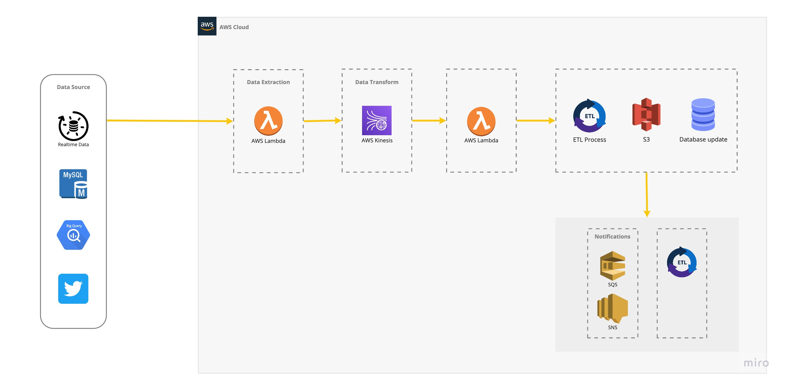

# Kinesis Demo 


### STEP 1 Create Data Stream 
```powershell
1. Data stream name: my-data-stream
2. Capacity mode: Provisioned
3.  Shard estimator: 1 (or you can custom your shard as below based on needs)
    * Maximum number of records written per second: 4
    * Average record size (in KiB): 1024
    * Reading from the stream: 20
4. Create Data Stream
```

### STEP 2 Create Lambda Function 

```powershell
1. permission: AmazonKinesisFullAccess
2. runtime: python 3.9
4. Funciton 1 - Publisher: see kinesisConsumer.py
5. Funciton 2 - CONSUMER: see kinesisPublisher.py
    * Add Trigger to my-data-stream
```

### STEP 3 Create 2nd Data Stream
```powershell
1. Build Stream 
    * Data stream name my-data-stream-2
    * Capacity mode on-demand
    * Create Data Stream
2. Create S3 Bucket （kinesis-stream-demo-bucket）
3. Create a delivery stream in 'my-data-stream'
    * source stream Amazon Kinesis Data Streams 
    * Destination Amazon S3
    * source settings arn:aws:kinesis:ap-southeast-2:330964433409:stream/my-data-stream-2
    * Delivery stream name KD2-S3-Demo
    * S3 bucket kinesis-stream-demo-bucket 
4. Create Delivery Stream
```

### STEP 4 Test Lambda

### STEP 5 Check S3 Folder